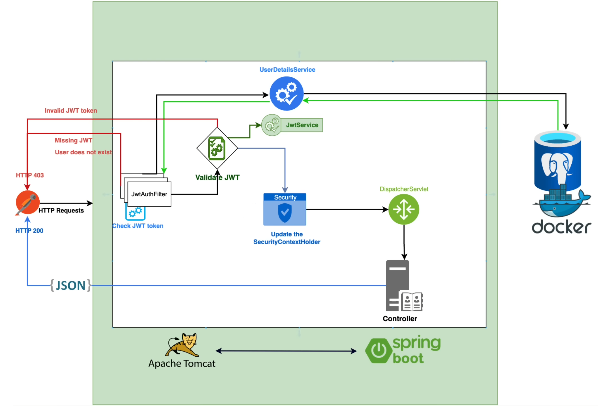

# Spring Boot 3 and Spring Security 6 JWT

## Design:


## Requests:

### GET secured endpoint:
http://localhost:8080/api/v1/demo-controller

### POST register:
http://localhost:8080/api/v1/auth/register

Body:
```json
{
    "firstname": "John",
    "lastname": "Papadopoulos",
    "email": "john@mail.com",
    "password": "1234"
}
```

### POST authenticate

In order to get authentication token:

Body:
```json
{
  "email": "john@mail.com",
  "password": "1234"
}
```